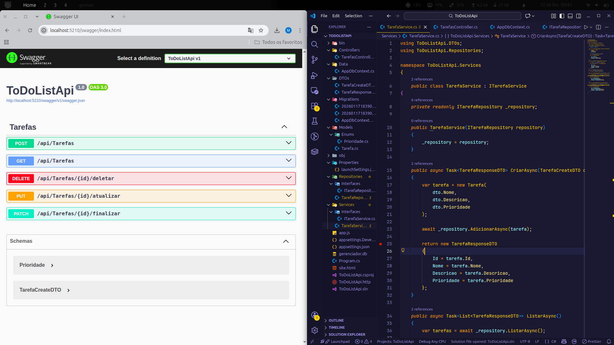

# ✅ Desafio-ToDoList  
### API RESTful de Gerenciamento de Tarefas  
**ASP.NET Core (.NET 8) + Entity Framework Core + SQLite**

🚀 API moderna para gerenciar tarefas, seguindo boas práticas de arquitetura, Clean Code e documentação com Swagger.

---

## 📌 Visão Geral

Este projeto permite:

✅ Criar tarefas  
📋 Listar tarefas  
✏️ Atualizar tarefas  
🗑️ Excluir tarefas  

Tudo via **endpoints RESTful**, com persistência em banco SQLite.

---

  

---

## 🧱 Tecnologias Utilizadas

ASP.NET Core (.NET 8)  
Entity Framework Core  
SQLite  
SQL Server (suporte opcional)  
Swagger / OpenAPI  
Dependency Injection  
Repository Pattern  
Service Layer  
CORS  

---

## 📂 Estrutura do Projeto

/Controllers   → Endpoints da API
/Data          → DbContext e acesso ao banco
/Models        → Entidades do domínio
/Repositories  → Camada de dados
/Services      → Regras de negócio

🛠️ Pré-requisitos

✅ .NET SDK 8
https://dotnet.microsoft.com/download

✅ Git (opcional)
https://git-scm.com/

✅ IDE recomendada
Visual Studio | VS Code | Rider

📥 Clonando o Repositório
git clone https://github.com/seu-usuario/todolist-api.git
cd todolist-api

📦 Restaurando Dependências
dotnet restore

🗄️ Banco de Dados (SQLite)

Arquivo:
gerenciador.db

Connection String:

builder.Services.AddDbContext<AppDbContext>(options =>
    options.UseSqlite("Data Source=gerenciador.db"));
🧱 Criando o Banco de Dados
dotnet ef migrations add InitialCreate
dotnet ef database update

Se não tiver EF Tool:

dotnet tool install --global dotnet-ef
▶️ Rodando o Projeto
dotnet run
🌐 URL da API

https://localhost:5001

http://localhost:5000

📄 Swagger — Testar Endpoints

👉 https://localhost:5001/swagger

Você poderá:

📌 Testar requisições

📖 Visualizar rotas

🚀 Executar POST, GET, PUT e DELETE

🔄 Endpoints Principais
Método	Rota	Descrição
GET	/api/tarefas	Listar tarefas
GET	/api/tarefas/{id}	Buscar por ID
POST	/api/tarefas	Criar tarefa
PUT	/api/tarefas/{id}	Atualizar tarefa
DELETE	/api/tarefas/{id}	Excluir tarefa

🔓 Configuração CORS
builder.Services.AddCors(options =>
{
    options.AddDefaultPolicy(policy =>
        policy.AllowAnyOrigin()
              .AllowAnyHeader()
              .AllowAnyMethod());
});
🧠 Conceitos Aplicados

Arquitetura em camadas
Repository Pattern
Service Layer
Injeção de Dependência
Clean Code
Boas práticas REST
Separação de responsabilidades

🧪 Ferramentas para Teste

Postman
Insomnia
Swagger UI
React / Angular / React Native

🚀 Objetivo do Projeto

Projeto desenvolvido para treinar backend moderno em .NET, aplicar boas práticas e criar um projeto forte para portfólio no GitHub.

👨‍💻 Autor

ySkillo - Matheus Gomes
💻 Desenvolvedor .NET
🔥 Backend | APIs | Clean Architecture

